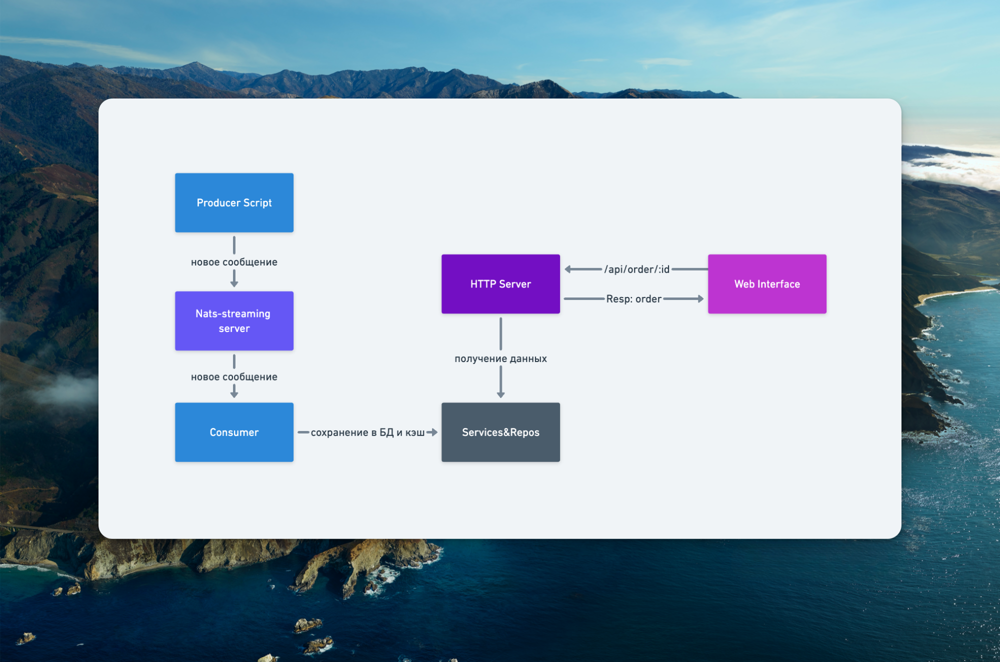

## Workflow

Сервис состоит из 3-х частей: 
- `HTTP Server` - HTTP-сервер, который принимает запросы от клиентов и отправляет данные о заказе по ID.
- `Consumer (Subscriber)` - подписчик, который слушает определенный канал *NATS-streaming server'а*, и сохраняет данные о заказе в базу данных.
- `Скрипт producer'а` - скрипт для демонстрации работы, который отправляет данные о заказе в канал *NATS-streaming server'а*.

## Simple interface

- Простой интерфейс для работы с HTTP-сервером.

## WRK benchmark

- Бенчмарк на 30 секунд, используя 12 потоков и поддерживая 400 открытых HTTP-соединений.

## Stack

- Golang
- NATS-streaming server
- PostgreSQL
- Docker
- Redis